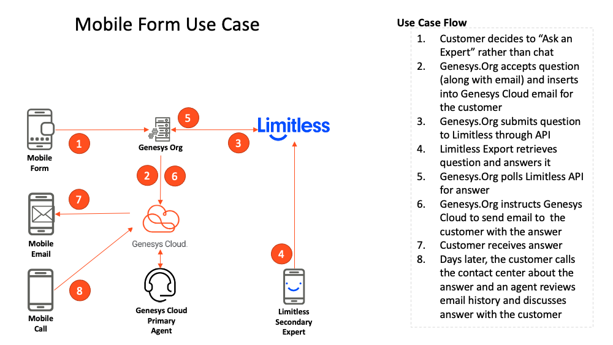

# limitless-blueprint-email
This Genesys Blueprint provides instructions for integrating the Limitless into Genesys Cloud. The integration connects a Genesys Cloud email flow through the Limitless APIs to Experts who are using the SmartCrowd platform.  Thus, questions submitted to web form are sent to Genesys Cloud through email and then routed to Limitless experts who can answer the questions and classify the questions for further processing by the Email flow.

Gig CX is available on multiple channels and in this blueprint it starts from web form on your website.  Your customers can ask a question (along with their email to receive the reply) and Genesys Cloud routes the question to a Gig Expert on the Limitless SmartCrowd platform who is available and can answer the question.

This question is presented to a collection of Gig Experts.  An expert who is logged into Limitless SmartCrowd will see all the available questions and will select a question with which they have personal experience and then receive a reward (e.g., $2) if they successfully resolve the case.  The Expert also classifies the answer for reporting in the Genesys Cloud performance view.

The customer will receive an email with the answer and can reply to continue the conversation.  This back and forth can happen as many times as needed to satisfy the customer’s question.

