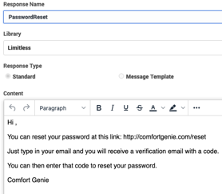

# Introduction

Welcome to the wonderful world of Gig Customer Service – also known as Gig CX! This blueprint is a great opportunity for you to learn about Genesys Cloud Email Flows, Data Actions, Agent Scripts, and Canned Responses. And if you put all those things together in the right order, you get Genesys Cloud Gig CX.

But that is only half the solution – you also need a Gig CX partner. In this blueprint we will be partnering with Limitless. You can learn more about them at: [https://www.limitlesstech.com/](https://www.limitlesstech.com/)

To set the stage, lets watch a video of Gig CX in action. Here&#39;s the link: [https://vimeo.com/494195499/ec5c644dcd](https://vimeo.com/494195499/ec5c644dcd) Go ahead, watch the video. It&#39;s less than five minutes. I&#39;ll wait.

Good. Welcome back. So, to review, Gig CX brings brand experts into the contact center conversation, but under the guidance of the contact center rules and decisions. And yes, this will be on the test. So, write that down.

The video highlighted six main elements:

1. The enterprise and its &quot;Engage an Expert&quot; webform
2. A customer who wants to ask a question
3. The Genesys Cloud email endpoint and associated email flow
4. A Limitless Expert using the SmartCrowd application
5. A Genesys Cloud agent who was brought into the conversation
6. And reporting through Genesys Cloud flow outcomes

This blueprint is going to take you through installing and configuring your Genesys Cloud organization to recreate this use case under the email channel. There are other blueprints that cover other channels like chat, SMS, and more. We decided not to cover FAX because that is no longer considered hip. But, alas, the phrase hip itself is no longer hip. The whole FAX/hip conundrum is a vicious cycle of un-hipness. But I digress.

# The Limitless Partnership

Well, this is certainly the first step. Without Limitless there would be no Experts in our blueprint. So, it is important that you go and get your own Limitless account. You will need to things:

1. Your API Key (x-api-key) from Limitless
2. The Group Name for your demo – also from Limitless
3. A login and password for an Expert in that group

We are going to use the API key in the definition of the Data Action that will be sending the customer question through the Limitless API. The Group Name will be passed in through the Data Action. And you will log into the Limitless SmartCrowd web site to access the customer question using your login and password for the expert.

# The Data Actions

We will use Data Actions to call the Limitless APIs. There are five data actions saved in this blueprint under the &quot;Data Actions&quot; subdirectory. Before you import the Data Actions you should be sure to have the &quot;Web Services Data Actions&quot; integration installed and made active. You can read more about installing and activation this integration here: [https://help.mypurecloud.com/articles/about-web-services-data-actions-integration/](https://help.mypurecloud.com/articles/about-web-services-data-actions-integration/)

Now we just import each of the five Data Actions. You can learn how to import Data Actions here: [https://help.mypurecloud.com/articles/import-or-export-a-data-action-for-integrations/](https://help.mypurecloud.com/articles/import-or-export-a-data-action-for-integrations/)

After you have imported all five Data Actions your Data Action list should look like this:

 

Let&#39;s look at the &quot;Limitless Push Question&quot; Data Action. The Contracts define what we need to send to Limitless. We&#39;ll see how these are populated in the Architect Flow. In the Configuration Setup you see the &quot;Request URL Template&quot; which is pointing to the Limitless Servers.

And below that you see the headers section and the x-api-key field. That value to the right of it need to be populated with your API-KEY from your Limitless account.

Once you have that populated you can go to the Test section and test and give it a try. Put the Group Name you received from Limitless in the &quot;groupName&quot; field. Then make sure you have a valid email address in the &quot;customerEmail&quot; field and place a question in the &quot;body&quot; field. You can put anything you like in the other fields. Hit the &quot;Run Action&quot; button and see if your question appears in the Limitless web page.

 

The Data Action itself should come back with success and a lot of values for msgid, customerEmailHash, etc. If you didn&#39;t see &quot;Action successfully run&quot; then we need to sort out the x-api-key.

And then you should see your question in the Limitless website. You can respond to your question right there, but your response won&#39;t really go anywhere. It will just sit on the Limitless server until we build our Architect Email flow to retrieve it.

There are three other Data Actions that also need to have the x-api-key defined for the calls to Limitless: &quot;Limitless Check If Timeout&quot;, &quot;Limitless Pull Full Answer&quot;, and &quot;Limitless Submit Follow Up Question&quot;. Replace the x-api-key in each data action then publish all four Data Actions so that we can use them in the Architect Email Flow.

There is one other Data Action called &quot;Limitless Send Email Reply&quot;. This data action is a bridge to an SMTP server to send the answer from the expert as a reply email to the customer. You may be asking yourself, &quot;Why not use the Send Auto Reply block in Architect rather than a Data Action?&quot; And the answer is that while you can use the Send Auto Reply block – that block is able to reply only once in an email thread. So, if the customer were to ask a follow up question of the expert – the Send Auto Reply block would not send the second reply. Thus, we use a Data Action called &quot;Limitless Send Email Reply&quot; to send our email out through an SMTP server, and we can send as many emails to the customer as needed.

So, you will need to configure the &quot;Request URL Template&quot; of the &quot;Limitless Send Email Reply&quot; Data Action to point to your SMTP server and then also change the &quot;Request Body Template&quot; to pass along the credentials and the email content. We use SocketLabs.io for our blueprint and you can create a free SocketLabs.io account for this Data Action. Just change out the &quot;APIKey&quot; value in the &quot;Request Body Template&quot; to your APIKey from SocketLabs.io and you will be good to go. Be sure to test this data action by putting in a &quot;Subject&quot;, &quot;Body&quot;, &quot;ToAddress&quot;, and &quot;ToName&quot;. After hitting &quot;Run Action&quot; you should have received a test email if you choose your email address for the &quot;ToAddress&quot;. Be sure to save and publish this Data Action.

Great, now we have all five data actions published and we can use them in our Architect Email Flow.

# The Architect Email Flow

To accept question from our customers and send them to Limitless we need an Architect flow. Let&#39;s import the flow that you can find in the &quot;Architect Flows&quot; subdirectory of this blueprint. It&#39;s called &quot;Accept Question …&quot; If you need help importing an Email flow, please check out this article from the Genesys Cloud Resource Center: [https://help.mypurecloud.com/articles/import-export-call-flow/](https://help.mypurecloud.com/articles/import-export-call-flow/)

That flow has two states, the &quot;Initial State&quot; and the &quot;Wait for Response&quot; state. Both are going to show a low of validation errors because there are still a few more items that need to be created before the flows can be published. Let&#39;s walk through the flows to examine the logic and also define the blocks of Flow Outcomes, Transfer to ACDs, Screen Pops, and Canned Responses.

## Initial State

The very first step in our &quot;Initial State&quot; flow is a Switch block. That Switch block is very important because it represents the first decision as to how to process a customer question. In that Switch block are four paths: Cancel, Reset, Tracking, and Default.

### Cancel

Case 1: Cancel – this choice is looking for the keyword &quot;cancel&quot; in the question. For example, if the customer asks, &quot;How do I cancel my account?&quot; we really don&#39;t want an Expert to help them cancel. Cancelation and other similar customer requests are best handled by a Genesys Cloud agent. And so, the email flow directs the customer to an agent through the &quot;Transfer to ACD&quot; block to the appropriate queue.

And that brings us to our first validation error – the queues. You will need to create a queue of agents to handle customer questions that have been diverted or escalated. In this blueprint I use one queue for all these circumstances and that queue is called &quot;Expert Support&quot;. So please do create a queue (if you don&#39;t already have one) and use that queue for all the &quot;Transfer to ACD&quot; blocks. If you need help creating a queue for your agents look here for guidance: [https://help.mypurecloud.com/articles/create-queues/](https://help.mypurecloud.com/articles/create-queues/)

After you have configured all the &quot;Transfer to ACD&quot; blocks in both the &quot;Initial State&quot; flow and the &quot;Wait for Response&quot; flow you will see a lot less validation errors.

 

Just before we send the customer&#39;s question about cancelation to an agent, we use the &quot;Set Flow Outcome&quot; block to tag this interaction as a &quot;Limitless Immediate Route to Agent&quot;. This will help us in reporting later when we review Flow Outcomes from the Genesys Cloud Performance menu. So, at this point we might as well go ahead and define all our Flow Outcomes. You can access that section from the Genesys Cloud Admin screen under Architect.

Here is a screen shot of the Flow Outcomes used in this blueprint. Please define each of these outcomes and then go through the two flows &quot;Initial State&quot; and &quot;Wait for Response&quot; to use these outcomes in the &quot;Set Flow Outcome&quot; blocks. Once that has been done there will be even fewer validation errors in the Email flow.

### Reset Password

Case 2: Reset – this branch is looking for the keyword &quot;reset&quot; in the question. For example, if the customer asks, &quot;How do I reset my password?&quot; we really don&#39;t want to incur the expense of an Expert to answer frequently asked questions. Obviously, this case handles only one question, but you get the idea. This whole case statement could be built as a bot or much more complicated matching process. But, for blueprint purposes, this works just fine.

We want to give the customer a nicely formatted response, so we use the &quot;Get Response&quot; block. Responses are like text macros and you define them in the Genesys Admin page under the &quot;Contact Center&quot; section using the &quot;Canned Responses&quot; option.

 

We have three responses defined in this blueprint and you will need to create the &quot;PasswordReset&quot; response to support this case of the switch statement.

 

The canned response should look something like what is defined on the screen beside here. You can have whatever you like in your canned response. To learn more about Canned Responses please follow this link: [https://help.mypurecloud.com/articles/about-canned-responses/](https://help.mypurecloud.com/articles/about-canned-responses/)

Once you have saved your Canned Response for PasswordReset you want to make sure it is selected in the &quot;Get Response&quot; block. And once you have done that you will have removed one more validation error.

And what do we see right after the &quot;Get Response&quot; block? It is none other than that &quot;Send Auto Reply&quot; that I warned you about earlier. Why would I use it here? Because in this case we do not expect subsequent &quot;Send Auto Reply&quot; activity. Once we send the reset password response through &quot;Send Auto Reply&quot; then we end the flow. End of conversation. Done. Finale. Whew.

### Follow-up Question

Case 3: Tracking – this branch is looking for the keyword &quot;Tracking|&quot; in the body of the email. If we find that exact string, then we can tell this is a follow-up question from the customer back to the expert. Let&#39;s come back to this path after we have covered the path where we submit out first question to the expert.

### Initial Question

Case 4: Default – this branch is where the fun begins. We are going to leverage the Data Action &quot;Limitless Push Question&quot; to send the body of the email to our pool of Experts.

Let&#39;s look at the data we are passing to Limitless. The groupName comes from Limitless as the group that contains our Experts. We send the Email.ConversationId to Limitless so that we can tie the Expert&#39;s answer back to our customer. The customer email, first name, and last name also come from the inbound email.

The body of the email contains our question and we also set the message type to &quot;question&quot;. We time stamp the API call and then indicate that this channel is from a &quot;WebForm&quot;.

So, basically, we are converting our incoming email directly to the Data Action API call onto Limitless.

The Data Action will return a message ID that we store in the flow variable msgId. We will need this ID later in the Tracking case when we submit a follow-up question back to Limitless. Limitless will then use that msgId to route the follow-up question back to the same Expert and show the Expert the entire dialog history.

If this Data Action were to fail, then you can see the two &quot;Set Flow Outcome&quot; paths for &quot;Failure&quot; and &quot;Timeout&quot; and then we transfer the customer email to a Genesys agent in the queue. This is important in that we don&#39;t let any customer questions drop on the floor. We always have our agents to leverage in times of trouble. You will see this &quot;Failure&quot; path after each Data Action call.

When the Data Action succeeds, we have an &quot;Update Data&quot; block to save the output of the Data Action. We will use these values when we construct the email reply to the customer.

And then we use the &quot;Call Task&quot; block to invoke the &quot;Wait for Response&quot; Reusable Task. This is the part of the flow where we will wait on Limitless to engage an Expert, receive their answer, and make it available to our flow. We will cover that next.

## Wait for Response

This purpose of this Reusable Task is to loop until one of two things happen: either we get a response from Limitless regarding an answer to the question or we have looped 60 times. Let&#39;s discuss the second option.

Limitless needs time to allow the Expert to encounter the question, select the question, and answer the question. Limitless Experts, unlike Genesys agents, are not paid to constantly monitoring the Limitless app. In the Gig economy, the Experts answer questions when the mood strikes them. Like when they take a break for lunch. Or when they have free time during the evening. The goal is to have many Experts available and thus minimize the delay in getting an answer. But delays of several minutes are not uncommon. So, it is important to be sure the customer knows, when they are asking a question, that the response may take a few minutes and that they should be patient.

And that is really the crux of Gig CX. For example, would you be willing wait a few minutes to get an answer from an expert who has the same product you have and uses it the same way you use it? I would. And that is different for a product return or a shipping status question. For those kinds of questions, I need a Genesys Cloud agent who can look deep into the enterprise to get the results that I need. But, when it comes to opinions or advice, I would rather have an email conversation with an Expert than any kind of conversation with an agent.

So, we loop, and we wait. Loop and wait. Loop. Wait. Loop … wait, what happened? We got an answer back from Limitless. And that happens in the &quot;Call Data Action&quot; block where we use the &quot;Limitless Pull Full Answer&quot; Data Action to check to see if the answer is ready. We know it is ready if the &quot;Decision&quot; block sees an even number of messages in the count (that comes back from the Limitless call.) An odd number of messages means that we have a customer question that is unanswered. An even number means that we have an answer for each customer question.

There is an extra condition in the &quot;Decision&quot; block regarding the Escalate flag from Limitless. If that flag is set, then we don&#39;t need to worry about message count. If the Expert did an escalation, then we just need to send this message to a Genesys agent. And that second &quot;Decision&quot; block is the path to escalate a question to an agent after setting the flow outcome. Also, the &quot;Set Screen Pop&quot; is used to populate a script for the agent to see what happened with the Expert.

Let&#39;s go ahead and create the Script for our screen pop. You do this in the Genesys Cloud Admin page under the &quot;Contact Center&quot; section using the &quot;Scripts&quot; choice. There you can import the script &quot;Limitless Script&quot; from the blueprint package. You can review importing scripts at this link: [https://help.mypurecloud.com/articles/import-scripts/](https://help.mypurecloud.com/articles/import-scripts/)

 

This script is somewhat involved by showing the agent the question from the customer, the answer from the Expert and any escalation reason from the Expert.

There is also a button to show the entire dialog that happened between the customer and the expert.

This really helps the agent come up to speed on the interaction and support the customer.

Now if the Expert does not force an escalation, then we need to convert the answer into an email to send back to the customer. We do that with the &quot;Get Response&quot; block. This is very similar to the &quot;Get Response&quot; block used for the Reset password answer. But now we get to format both the customer question and the Expert answer into an email.

Looking at the Expert Answer canned response we see that we can say Hi to the customer, show them their question, show the Expert answer, and then add a tracking code at the end of the email. This tracking code has all the information we will need to route any subsequent questions back through Limitless. We will cover that usage when we revisit the Tracking case of the initial switch statement.

And that takes us to the &quot;Call Data Action&quot; block which is leveraging the &quot;Send Email Reply&quot; data action. That data action is using the SMTP server to send our Experts&#39; answer back to the customer.

We wrap up this &quot;Wait for Response&quot; flow by checking to see if the Expert classified the answer with a code that is useful to the contact center. The &quot;Switch&quot; block is looking at the Response Code from Limitless to set various Flow Outcomes. And if the Response Code is &quot;Ready to Purchase&quot; then we use the &quot;Set Screen Pop&quot; block to pop a script to the agent in the same way we did it after an Escalate condition. Then we exit the loop and end the task. And directly after that we exit the Initial State as well. Thus, we are done – we have given the customer an Expert answer. Please feel free to take the rest of the day off.

## Initial State Again

But we need to go back and cover the case where the customer has received an answer from an Expert – but then replies to that answer with another question. That is the Tracking path of the &quot;Initial State&quot; switch block.

### Follow-up Question

Case 3: Tracking – as noted before, this branch is looking for the string &quot;Tracking|&quot; in the body of the email. If we find that exact string, then we can tell this is a follow-up question from the customer back to the expert.

And that&#39;s where those msgId values come into play. We saved them by placing them at the bottom of the email that we sent to the customer. So, there are a couple of &quot;Update Data&quot; blocks to extract those key values from the email message body. Then we use those values in the &quot;Call Data Action&quot; that checks with Limitless to see if the transaction has expired in the Limitless server using the &quot;Limitless Check If Timeout&quot; Data Action.

If the Data Action succeeds, then we can make the decision about what to do about timeout. If the message has timed out in Limitless (for example, if the customer responds to the email many days later) then we simply escalate the message to a Genesys agent after setting the Flow Outcome.

But if the message has not timed out, then we can submit it to Limitless using the Data Action &quot;Limitless Submit Follow Up Question&quot;. If that Data Action succeeds, then we do the same thing that we did when we submitted the initial question --- we wait for a response. And we do that by calling the Task &quot;Wait for Response&quot;.

Well, there you go. That&#39;s the entire Email flow. You should be able to save it, validate it, and publish it. And now it&#39;s time to put it to work. And we do that by assigning it to an email address.

# Genesys Cloud Email

To use the email channel to handle the questions form the customer we need to create an email address in Genesys Cloud that can accept our requests.

In the Genesys Cloud Admin page, you should see the Email choice under the Contact Center section (as shown to the right.) If you don&#39;t see Email as a choice, then you need to turn the Email feature on in your Genesys Cloud organization.

When you click on that you will see where you can define your email accounts. Here I show two existing email domains:

All we need to do is &quot;Add Domain&quot; to create a new domain if you don&#39;t already have one. Once that is created you can click on the domain to choose &quot;Add Email Address&quot; to create an email address for the demo:

We create the &quot;Email Address&quot; on that domain and define a &quot;From Name&quot;:

Then we scroll down to assign our newly published Architect Flow and hit &quot;Save&quot; to finish the creation of the email endpoint.

That now connects an email address to our email flow which uses all our Data Actions to talk to Limitless.

# The Web Form

You could simply send an email to your new email address to kick this whole thing off. But we can go one step better by creating a web form that sends the email for us and hides the email mechanics from the customer.

I used WordPress WP Forms to create a form that accepts the customer&#39;s name, email address, and question on our website. The form then takes that information and sends it as an email to our Genesys Cloud email address.

It&#39;s important at this point (when engaging the customer) to explain how asking an Expert is different from asking for an agent. Setting the expectations for the customer will help them appreciate the experience and have patience for the answer.

# Giving a Demo

So, at this point – we are good to go and ready to give a demo. Let&#39;s review that wonderful video that was built from this blueprint: [https://vimeo.com/494195499/ec5c644dcd](https://vimeo.com/494195499/ec5c644dcd)

It&#39;s inspirational, I know. And you too can give this same demo for your friends and famliy. After following this blueprint, you should be able to:

1. Create a Web Form to accept your customer&#39;s question
2. Send that question via email to your Genesys Cloud organization
3. Route that email from your email address into your Email Flow in Architect
4. Invoke the Limitless Data Actions in the Email Flow to send the question to the Limitless server
5. Log into your Limitless Expert account to view the question
6. Answer the question as a Limitless Expert
7. Wait for that response from the Expert in your Email Flow
8. Send the Expert&#39;s answer back to the customer from within the Email Flow

Wow, that&#39;s quite a feat. You really should consider taking the rest of the day off. But, if not, you could:

1. Reply to that email that you received as a customer
2. Have that reply received in Genesys Cloud and routed to your Email Flow
3. See the follow-up question sent to Limitless by having used the correct message IDs to ensure it goes back to the same Expert
4. Answer that question as the Expert and classify the response as &quot;Ready to Purchase&quot;
5. Watch your Email Flow pick up that response and send the Expert&#39;s answer back to the customer as an email.
6. Log into Genesys Cloud as an agent and receive the escalation of that interaction because it was &quot;Ready to Purchase&quot;
7. Review the response from the Expert through the Limitless Script
8. Send a canned response email to the customer with &quot;free shipping&quot; to help close the sale.

Wow, that is powerful. And that last step is no small thing – the last Canned Response. You can see that canned response here on the right.

This is just a standard Canned Response that the agent can invoke to try and help close a sale that an Expert indicated was going well.

But that gets to the core of belnding agents with Experts. Sometimes the agent can support the expert when the expert can&#39;t resolve an issue. And sometimes an Expert can help an agent by sharing information about the customer&#39;s progress in the contact center journey.

 

So it&#39;s only fitting that we end this blueprint with a Genesys Cloud report about Flow Outcomes about all the customer jouneys.

And there, you see, is the power of Gig-CX. Bringing empathy and expertise into the customer journey under the direction and guidance of the contact center. Enjoy!